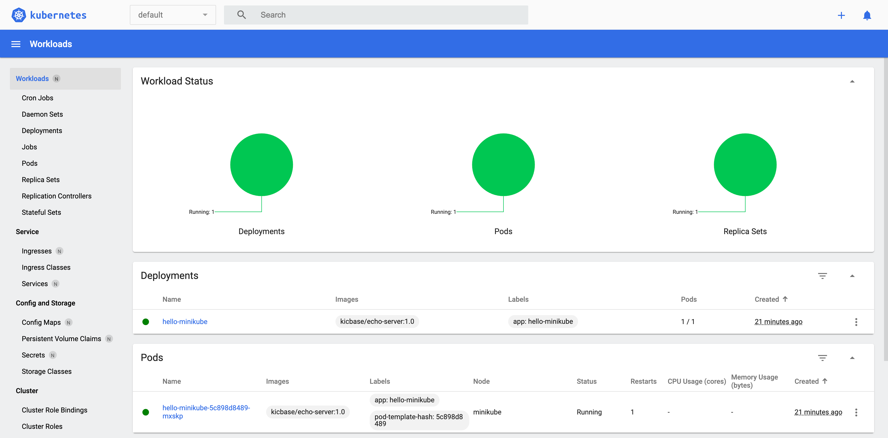
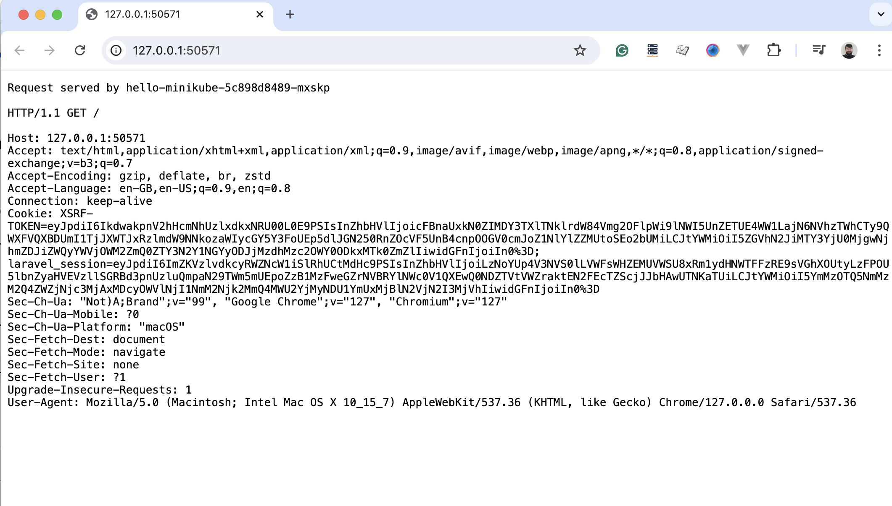
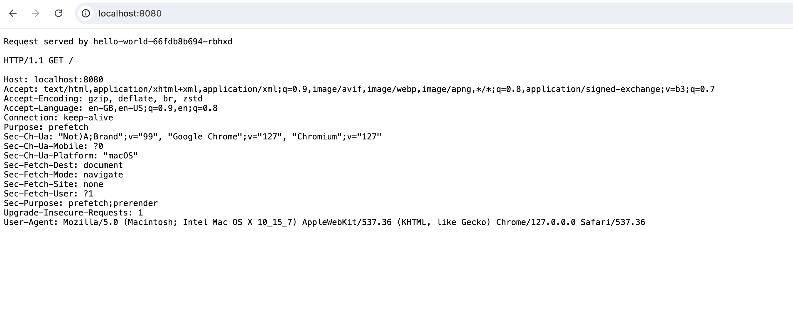
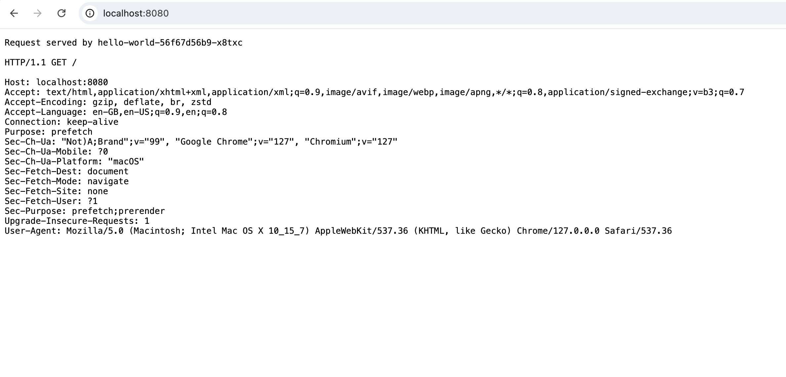

# Comparative Analysis of Tools for Local Kubernetes Cluster Deployment

## Introduction

The startup team "AsciiArtify" is considering three different tools for local Kubernetes cluster deployment: **minikube**, **kind**, and **k3d**. The goal is to choose the most suitable tool for the startup's Proof of Concept (PoC), taking into account the potential advantages and disadvantages of each option, as well as the risks associated with Docker licensing.

## Characteristics

| **Tool**     | **Supported OS**      | **Supported Architectures**        | **Automation**                                  | **Additional Features**                               |
|--------------|-----------------------|------------------------------------|-------------------------------------------------|-------------------------------------------------------|
| **minikube** | Linux, macOS, Windows | x86-64, ARM64, ARMv7, ppc64, S390x | Scripts for automating installation and updates | Built-in addons for monitoring and cluster management |
| **kind**     | Linux, macOS, Windows | x86, ARM                           | CI/CD integration, automation scripts           | Support for network plugins                           |
| **k3d**      | Linux, macOS, Windows | x86, ARM                           | Fast deployment via CLI, Helm support           | Easy integration with Rancher, RKE                    |

## Advantages and Disadvantages

| **Tool**     | **Advantages**                                                 | **Disadvantages**                       |
|--------------|----------------------------------------------------------------|-----------------------------------------|
| **minikube** | Easy to install and use, large community, wide range of addons | Limited scalability, resource-intensive |
| **kind**     | Suitable for CI/CD testing, allows multi-cluster scenarios     | Limited documentation, requires Docker  |
| **k3d**      | Fast deployment, easy to use, supports Helm and RKE            | Smaller community, Docker dependency    |

## Demonstration

### Example of Deploying "Hello World" on Kubernetes using minikube

#### Install minikube on Linux x86-64
```bash
curl -LO https://storage.googleapis.com/minikube/releases/latest/minikube-linux-amd64
sudo install minikube-linux-amd64 /usr/local/bin/minikube && rm minikube-linux-amd64
```

#### Install minikube on macOS
```bash
curl -LO https://storage.googleapis.com/minikube/releases/latest/minikube-darwin-amd64
sudo install minikube-darwin-amd64 /usr/local/bin/minikube
```
#### Start your minikube cluster
```bash
minikube start
```

#### Interact with your cluster
```bash
# Access your new cluster
kubectl get po -A

# Check additional insight of your cluster state
minikube dashboard
```


#### Deploy HelloWorld applications
```bash
# Create a sample deployment and expose it on port 8080
kubectl create deployment hello-minikube --image=kicbase/echo-server:1.0
kubectl expose deployment hello-minikube --type=NodePort --port=8080

# View all services
kubectl get services hello-minikube

# Access the service (minikube will launch a web browser)
minikube service hello-minikube
```


#### Stop your minikube cluster
```bash
minikube stop
```


### Example of Deploying "Hello World" on Kubernetes using kind

#### Install kind on Linux x86-64
```bash
# For AMD64 / x86_64
[ $(uname -m) = x86_64 ] && curl -Lo ./kind https://kind.sigs.k8s.io/dl/v0.24.0/kind-linux-amd64
# For ARM64
[ $(uname -m) = aarch64 ] && curl -Lo ./kind https://kind.sigs.k8s.io/dl/v0.24.0/kind-linux-arm64
chmod +x ./kind
sudo mv ./kind /usr/local/bin/kind
```

#### Install kind on macOS
```bash
# For Intel Macs
[ $(uname -m) = x86_64 ] && curl -Lo ./kind https://kind.sigs.k8s.io/dl/v0.24.0/kind-darwin-amd64
# For M1 / ARM Macs
[ $(uname -m) = arm64 ] && curl -Lo ./kind https://kind.sigs.k8s.io/dl/v0.24.0/kind-darwin-arm64
chmod +x ./kind
mv ./kind /some-dir-in-your-PATH/kind
```

#### Start your kind cluster
```bash
kind create cluster --name hello-world-cluster
```

#### Interact with your cluster
```bash
# Create a deployment
kubectl create deployment hello-world --image=kicbase/echo-server:1.0


# Expose the deployment as a NodePort service
kubectl expose deployment hello-world --type=NodePort --port=8080

# Get the NodePort
kubectl get service hello-world

# Use Port Forwarding
kubectl port-forward service/hello-world 8080:8080
```


### Delete your kind cluster
```bash
kind delete cluster
```


### Example of Deploying "Hello World" on Kubernetes using k3d

```bash
# Install k3d
curl -s https://raw.githubusercontent.com/k3d-io/k3d/main/install.sh | bash

# Create a cluster
k3d cluster create mycluster

# Check cluster status
kubectl get nodes

# Deploy the Hello World application
kubectl create deployment hello-world --image=kicbase/echo-server:1.0

# Create a service to expose the application
kubectl expose deployment hello-world --type=LoadBalancer --port=8080

# Check the availability of the application
kubectl get service hello-world

# Use Port Forwarding
kubectl port-forward service/hello-world 8080:8080

# Stop cluster
k3d cluster stop mycluster

# Delete cluster
k3d cluster delete mycluster
```



## Conclusion
Based on the comparative analysis, it is recommended to use k3d for the "AsciiArtify" startup's PoC.

minikube is suitable for local testing and development but has scalability limitations.
kind integrates well with CI/CD but its dependency on Docker may pose some risks in the future.
k3d provides an optimal balance between deployment speed and functionality, making it the best choice for the PoC.

## Recommendations
After analysis of 3 solution, I would recommend to use k3d for local development. Also consider using Podman. This can reduce the risks associated with Docker licensing.