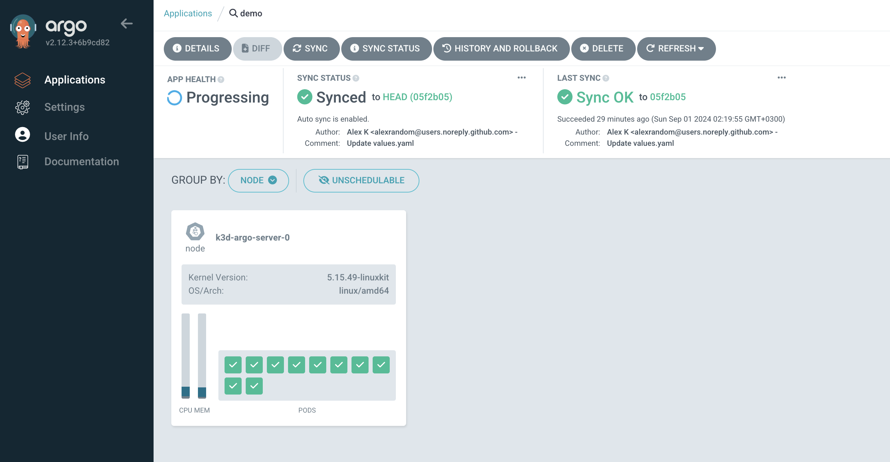
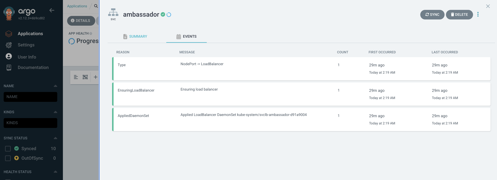
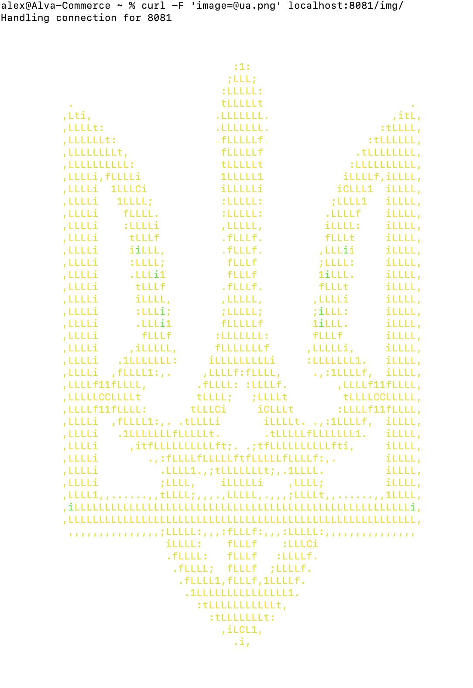

# Minimum viable product

Please check PoC [here](POC.md) and Kubernates local comparison options [here](Concept.md)

### Steps to run Demo Go Application

* Run Argo CD
* Add demo project https://github.com/alexrandom/go-demo-app with 'helm' path


* Check demo service
```bash
kubectl get svc -n demo
```
* Make port forwarding
```bash
kubectl port-forward -n demo svc/ambassador 8081:80
```
* Test Application
```bash
curl -F 'image=@ua.png' localhost:8081/img/
```



### Demonstration
