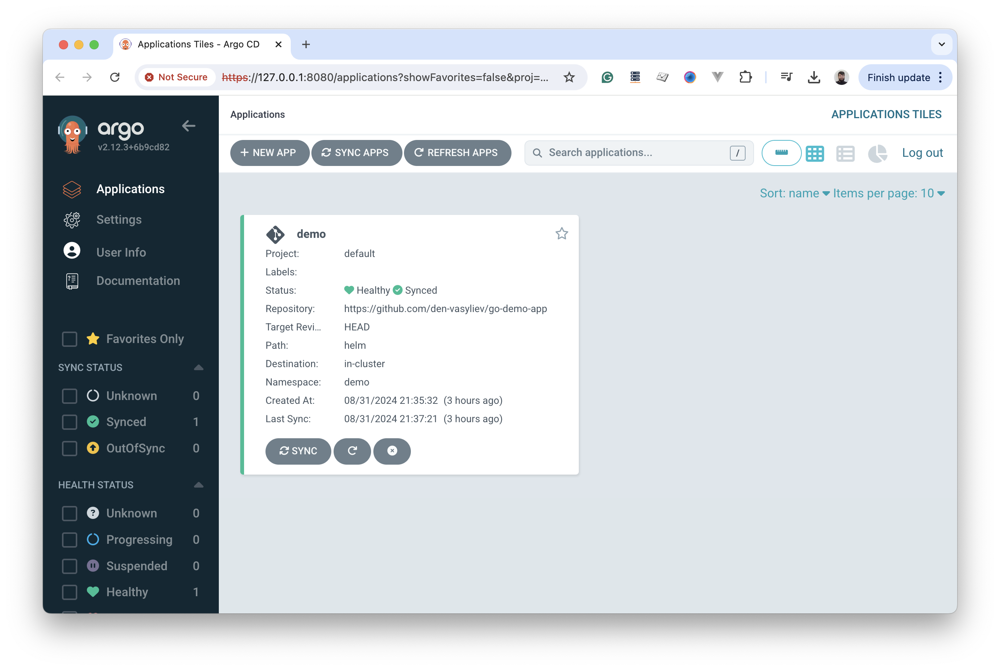

# Proof of Concept

Based on initial concept, K3D was choosen to launch Argo CD with our Demo project https://github.com/den-vasyliev/go-demo-app

### Steps to run Argo CD on top of K3D

Official Argo CD [documentaion](https://argo-cd.readthedocs.io/en/stable/).

```bash
# Start K3D cluster
k3d cluster create argo

# Check K3D clusters
k3d cluster list

# Create namespace for our Argo CD project
kubectl create namespace argocd

# Apply Argo CD Kubernetes manifest in our namespace
kubectl apply -n argocd -f https://raw.githubusercontent.com/argoproj/argo-cd/stable/manifests/install.yaml

# Check container status
kubectl get all -n argocd
kubectl get pod -n argocd -w

# Forward posrt for our local access under 8080 port
kubectl port-forward svc/argocd-server -n argocd 8080:443&

# Retrieve Argo CD admin password from secret 'argocd-initial-admin-secret' and decode it with base64
kubectl -n argocd get secret argocd-initial-admin-secret -o jsonpath="{.data.password}"|base64 -d;echo

# Delete 
k3d cluster delete argo
```



### Demonstration


